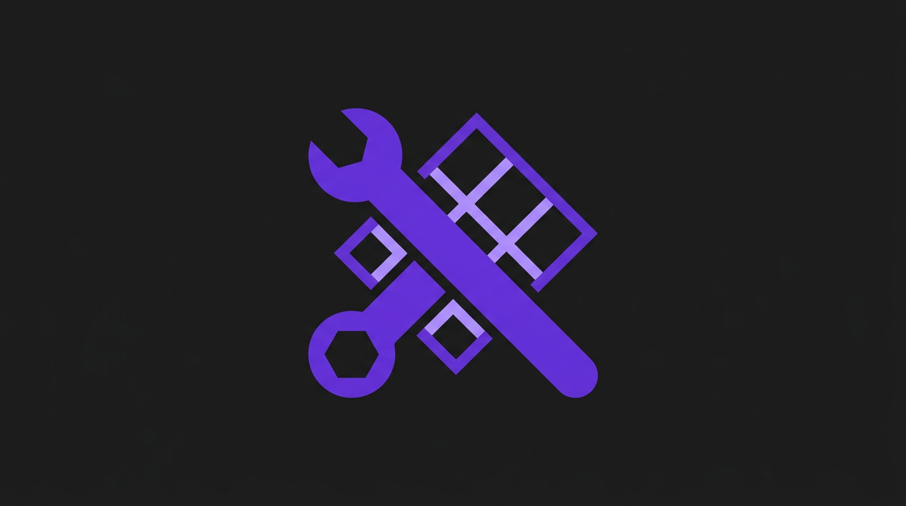
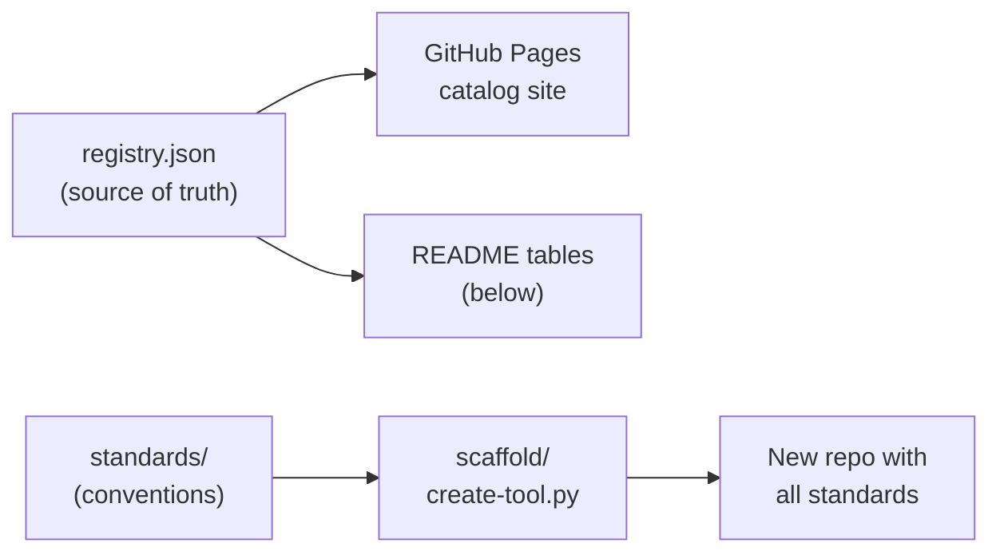

<div align="center">
 
</div>

<h1 align="center">Developer Tools Directory</h1>

<p align="center">
 <strong>Centralized catalog, standards, and scaffolding for TMHSDigital Cursor IDE plugins, MCP servers, and developer tools.</strong>
</p>

<p align="center">
 <a href="https://tmhsdigital.github.io/Developer-Tools-Directory/"></a>
 <a href="LICENSE"></a>
 <a href="https://github.com/TMHSDigital/Developer-Tools-Directory/stargazers"></a>
 <a href="https://github.com/TMHSDigital/Developer-Tools-Directory/actions/workflows/validate.yml"></a>
 <a href="https://github.com/TMHSDigital/Developer-Tools-Directory/actions/workflows/pages.yml"></a>
 <a href="https://github.com/TMHSDigital/Developer-Tools-Directory/actions/workflows/codeql.yml"></a>
 <a href="https://www.python.org/"></a>
 <a href="CONTRIBUTING.md"></a>
</p>

<p align="center">
 <a href="#tools">Tools</a> &bull;
 <a href="#standards">Standards</a> &bull;
 <a href="#scaffold-generator">Scaffold</a> &bull;
 <a href="https://tmhsdigital.github.io/Developer-Tools-Directory/">Catalog Site</a>
</p>

---

<p align="center">
 9 repos &nbsp;&bull;&nbsp; 186 skills &nbsp;&bull;&nbsp; 77 rules &nbsp;&bull;&nbsp; 377 MCP tools
</p>

## How It Works



**Registry** tracks every tool repo. **Standards** document conventions for CI/CD, folder structure, manifests, and versioning. **Scaffold** generates new repos that follow those standards automatically.

## Tools

| Tool | Type | Skills | Rules | MCP&nbsp;Tools | Links |
|:-----|:-----|-------:|------:|------:|:------|
| **CFX Developer Tools** | Plugin | 9 | 6 | 6 | [](https://github.com/TMHSDigital/CFX-Developer-Tools) [](https://tmhsdigital.github.io/CFX-Developer-Tools/) |
| **Unity Developer Tools** | Plugin | 18 | 8 | 4 | [](https://github.com/TMHSDigital/Unity-Developer-Tools) |
| **Docker Developer Tools** | Plugin | 17 | 10 | 150 | [](https://github.com/TMHSDigital/Docker-Developer-Tools) [](https://tmhsdigital.github.io/Docker-Developer-Tools/) [](https://www.npmjs.com/package/@tmhs/docker-mcp) |
| **Home Lab Developer Tools** | Plugin | 22 | 11 | 50 | [](https://github.com/TMHSDigital/Home-Lab-Developer-Tools) [](https://tmhsdigital.github.io/Home-Lab-Developer-Tools/) [](https://www.npmjs.com/package/@tmhs/homelab-mcp) |
| **Mobile App Developer Tools** | Plugin | 43 | 12 | 36 | [](https://github.com/TMHSDigital/Mobile-App-Developer-Tools) [](https://www.npmjs.com/package/@tmhs/mobile-mcp) |
| **Plaid Developer Tools** | Plugin | 17 | 7 | 30 | [](https://github.com/TMHSDigital/Plaid-Developer-Tools) |
| **Monday Cursor Plugin** | Plugin | 21 | 8 | 45 | [](https://github.com/TMHSDigital/Monday-Cursor-Plugin) [](https://tmhsdigital.github.io/Monday-Cursor-Plugin/) |
| **Steam Cursor Plugin** | Plugin | 30 | 9 | 25 | [](https://github.com/TMHSDigital/Steam-Cursor-Plugin) [](https://tmhsdigital.github.io/Steam-Cursor-Plugin/) |
| **Steam MCP Server** | MCP Server | -- | -- | 25 | [](https://github.com/TMHSDigital/steam-mcp) [](https://www.npmjs.com/package/@tmhs/steam-mcp) |

<details>
<summary>Tool descriptions</summary>

&nbsp;

| Tool | Description |
|:-----|:------------|
| **CFX Developer Tools** | AI-powered Cursor IDE plugin for FiveM and RedM resource development. Scaffold resources, look up 12,000+ natives, generate manifests, and write optimized scripts in Lua, JavaScript, and C#. |
| **Unity Developer Tools** | Cursor plugin for Unity game development with URP, HDRP, and Built-in render pipeline support. 20 snippets and 5 starter templates. |
| **Docker Developer Tools** | Expert Docker workflows for Cursor, Claude Code, and any MCP-compatible editor. Container management, Compose, and Dockerfile best practices. |
| **Home Lab Developer Tools** | Home lab and Raspberry Pi workflows with Docker Compose, monitoring, DNS, networking, backups, security, and administration via SSH. |
| **Mobile App Developer Tools** | Full mobile development lifecycle for React Native, Expo, and Flutter -- from project setup to app store submission. |
| **Plaid Developer Tools** | Cursor plugin and MCP companion for building on the Plaid API. Banking, fintech, and open-banking integrations. |
| **Monday Cursor Plugin** | Monday.com integration with boards, items, sprints, docs, dashboards, and GraphQL queries. |
| **Steam Cursor Plugin** | Steam and Steamworks integration for game developers, modders, and power users. Store data, achievements, Workshop, multiplayer, and cloud saves. |
| **Steam MCP Server** | Standalone MCP server for Steam and Steamworks APIs. 18 read-only + 7 write tools. Published on npm as `@tmhs/steam-mcp`. |

</details>

## Standards

Documented conventions for building new developer tools. All docs in [`standards/`](standards/).

| Standard | Summary |
|:---------|:--------|
| [Folder Structure](standards/folder-structure.md) | Canonical repo layout for plugins and MCP servers |
| [Plugin Manifest](standards/plugin-manifest.md) | `.cursor-plugin/plugin.json` specification and required fields |
| [CI/CD](standards/ci-cd.md) | GitHub Actions workflows every repo must have (validate, release, pages, stale) |
| [GitHub Pages](standards/github-pages.md) | Documentation site setup -- static HTML or MkDocs Material |
| [Commit Conventions](standards/commit-conventions.md) | Conventional commits and version bumping rules |
| [README Template](standards/readme-template.md) | Standard README structure and required sections |
| [AGENTS.md Template](standards/agents-template.md) | AI agent guidance file structure |
| [Versioning](standards/versioning.md) | Semver management and automated release flow |

<details>
<summary>Core principles</summary>

&nbsp;

1. **Automation first** -- CI handles versioning, releases, badge updates, and repo metadata. Manual edits to managed fields will be overwritten.
2. **Single branch** -- All repos use `main` only. No develop, staging, or release branches.
3. **Conventional commits** -- Every commit follows the conventional format. The release workflow parses them to determine version bumps.
4. **AI-agent friendly** -- Every repo includes `AGENTS.md` and `.cursorrules` so AI coding agents understand the project.
5. **Public by default** -- Standards, docs, and tooling are written for public consumption.

</details>

## Scaffold Generator

Generate a fully standards-compliant repository from the command line.

**Prerequisites:**

<a href="https://www.python.org/"></a> <a href="https://pypi.org/project/Jinja2/"></a>

```bash
pip install Jinja2
```

```bash
python scaffold/create-tool.py \
  --name "Unreal Developer Tools" \
  --description "Cursor plugin for Unreal Engine development" \
  --mcp-server \
  --skills 5 \
  --rules 3
```

<details>
<summary>All options</summary>

&nbsp;

| Flag | Required | Default | Description |
|:-----|:---------|:--------|:------------|
| `--name` | Yes | -- | Display name (e.g., "Unreal Developer Tools") |
| `--description` | Yes | -- | One-line description |
| `--slug` | No | auto | Kebab-case identifier (derived from name) |
| `--type` | No | `cursor-plugin` | `cursor-plugin` or `mcp-server` |
| `--mcp-server` | No | false | Include MCP server scaffold |
| `--skills N` | No | 0 | Number of placeholder skill directories |
| `--rules N` | No | 0 | Number of placeholder rule files |
| `--license` | No | `cc-by-nc-nd-4.0` | `cc-by-nc-nd-4.0`, `mit`, or `apache-2.0` |
| `--output` | No | `./output` | Output directory |
| `--author-name` | No | TMHSDigital | Author name for manifests |
| `--author-email` | No | contact@... | Author email |

</details>

<details>
<summary>What it generates</summary>

&nbsp;

- Full folder structure per the [standard](standards/folder-structure.md)
- Populated `plugin.json` with provided metadata
- All 4 core GitHub Actions workflows (validate, release, pages, stale)
- Skeleton docs: `AGENTS.md`, `CLAUDE.md`, `README.md`, `CONTRIBUTING.md`, `CHANGELOG.md`, `CODE_OF_CONDUCT.md`, `SECURITY.md`, `ROADMAP.md`
- GitHub Pages site template (`docs/index.html`)
- MCP server scaffold (if `--mcp-server`): `server.py`, `tools/`, `data/`, `requirements.txt`
- `.cursorrules`, `.gitignore`, `LICENSE`

</details>

## Project Structure

```
Developer-Tools-Directory/
  .github/
    workflows/             CI/CD (validate, pages, release, stale, codeql, dep-review, label-sync)
    release-drafter.yml    Release notes category config
  assets/                  Logo
  docs/                    GitHub Pages catalog site
  scaffold/                Repo generator + Jinja2 templates
  standards/               Convention documentation (9 docs)
  registry.json            Tool registry (source of truth)
  AGENTS.md                AI agent guidance
  CLAUDE.md                Claude Code project docs
  .cursorrules             Cursor IDE agent rules
```

## Contributing

<p>
 <a href="CONTRIBUTING.md"></a>
 <a href="CODE_OF_CONDUCT.md"></a>
 <a href="SECURITY.md"></a>
</p>

Pull requests welcome. See [CONTRIBUTING.md](CONTRIBUTING.md) for setup, how-to guides, and PR process.

## License

<a href="LICENSE"></a>

---

<p align="center">
 <strong>Built by <a href="https://github.com/TMHSDigital">TMHSDigital</a></strong>
</p>
